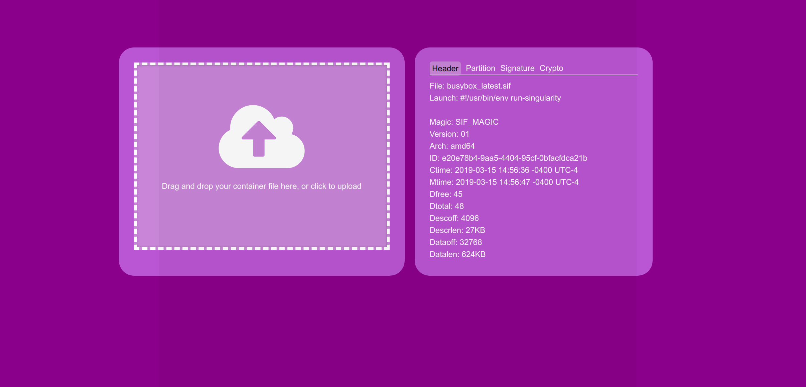

# Sifweb

This is a proof of concept for reading a container binary directly into a browser
using GoLang and Web Assembly. Specifically, we load a SIF header and display it:



It's a proof of concept because it works for small images. For large images we will need
to modify the code to read up to a maximum location that the header might be found,
or other tricks that can avoid reading all of the binary into the browser at once.
For now I'm very happy with this because I figured it out in under a day! :D

## Usage

If you are [testing online](https://vsoch.github.io/sifweb) you should first pull a small container:

```bash
$ singularity pull docker://busybox
# busybox_latest.sif
```

And upload it to the browser to show the header data. You can inspect the console
to see other messages that are coming directly from GoLang.

## Docker

If you want to test locally, you'll need GoLang version 1.13 or higher. The reason
is because we use a function [CopyBytesToGo](https://tip.golang.org/pkg/syscall/js/#CopyBytesToGo)
that was just recently added. First, build the container. 

```bash
$ docker build -t vanessa/sifweb .
```

It will install [emscripten](https://emscripten.org/docs/getting_started/FAQ.html),
add the source code to the repository, and compile to wasm. You can then
run the container and expose port 80 to see the compiled interface:

```bash
$ docker run -it --rm -p 80:80 vanessa/sifweb 
``` 

Then you can proceed to upload your container.
